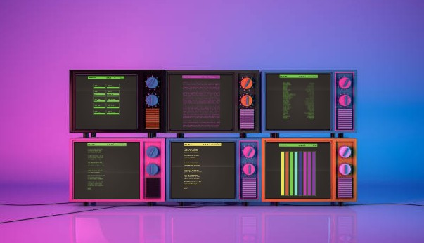
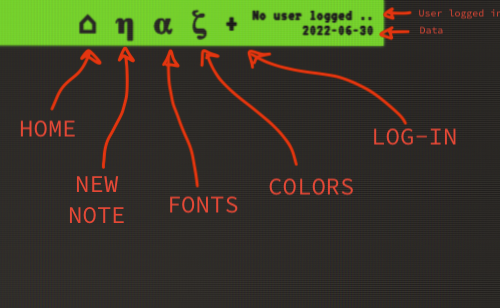

<h1>Notalgic - NOTe tAker for nostaLGIC</h1>
<h2>Take note in a different (vintage) way</h2>

  

<h2>For whom codes all the day ⌨️, and old-fashioned people! 🕰️</h2>

  Notalgic is a very useful web app that's basically create notes but in a different way! It makes possibile access to your Google account in order to write stunning text. Available in any (vintage) font - more than 25! - and different stunning led neon colors!

The web app takes the user by the hand and guides him towards infinite cascades of words: writers, coders, artists, students, come here! There's an app for you!

  
<h2>A (very) strange tale... ⏳</h2>
<ol>
  <li>VUE 3</li>
  <li>Pinia</li>
  <li>Typescript</li>
  <li>Vite</li>
  <li>Nginx</li>
  <li>Linode</li>
  <li>Firebase</li>
  <li>...</li>
</ol>

<h3>More info about?</h3>
<a href="https://casiimir.hashnode.dev/notalgic-note-taker-for-nostalgic">Follow this link to Hashnode</a>

<h2>MIT License</h2>
Hashnode, Linode, Linode Hackathon

